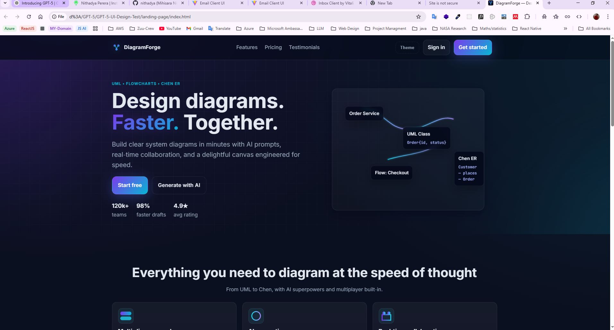
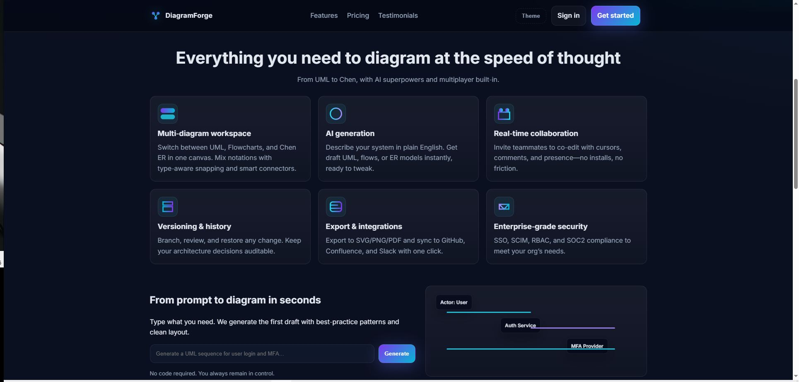
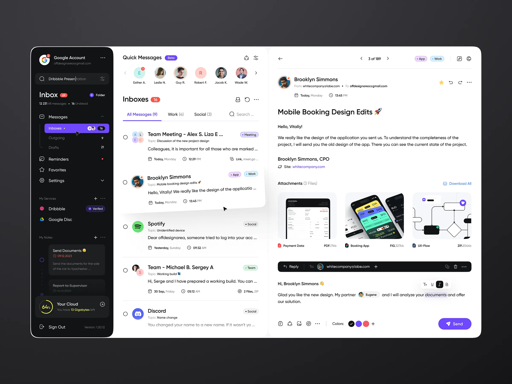
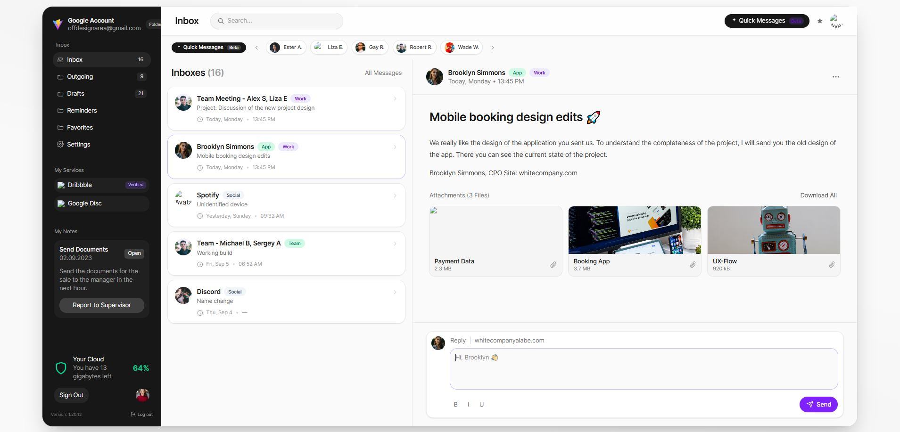

## GPT‑5 front‑end generation tests: landing page + UI clone

> “GPT‑5 is our strongest coding model to date. It shows particular improvements in complex front‑end generation and debugging larger repositories. It can often create beautiful and responsive websites, apps, and games with an eye for aesthetic sensibility in just one prompt, intuitively and tastefully turning ideas into reality. Early testers also noted its design choices, with a much better understanding of things like spacing, typography, and white space.”

This repository documents my quick hands‑on tests of those front‑end claims. I ran two small experiments:

- **Test 1 — landing page**: ask GPT‑5 to produce a polished product landing page with animation, theming, and pricing interactions using vanilla HTML/CSS/JS.
- **Test 2 — UI clone from an image**: provide a single inspiration image of an email client and ask GPT‑5 to recreate it with React + TypeScript + Tailwind, broken into clean components.

Both results are committed here along with the original reference asset(s) and screenshots.

### Repository layout

```
GPT-5-UI-Design-Test/
├─ landing-page/                # Vanilla web implementation
│  ├─ index.html
│  ├─ styles.css
│  ├─ script.js
│  ├─ result-1.JPG              # Screenshot 1 (hero)
│  └─ result-2.JPG              # Screenshot 2 (features)
└─ UI-Clone-Test/               # React + TS + Tailwind + Vite
   ├─ emailclient.webp          # Input inspiration image
   └─ src/assets/result-3.JPG   # Screenshot of GPT‑generated clone
```

---

## Test 1 — Landing page (vanilla HTML/CSS/JS)

- **Goal**: A modern, responsive SaaS landing page with tasteful gradients, motion, theme toggle, and simple pricing switcher.
- **Tech**: static `index.html`, `styles.css`, and `script.js` inside `landing-page/`.
- **Highlights**:
  - Semantic HTML and accessible controls (skip link, ARIA labels, reduced‑motion friendly reveals)
  - **Theme toggle** (light/dark) with preference stored in `localStorage`
  - **Pricing toggle** with yearly/monthly prices and dynamic copy
  - Intersection‑observer powered reveal animations and a small carousel for testimonials

### Screenshots





### Run locally

- Quick open: double‑click `landing-page/index.html` in a browser.
- Or serve on a local port (recommended for consistent asset loading):

```bash
npx serve -s landing-page -l 5174
```

---

## Test 2 — UI clone from a single image (React + TypeScript + Tailwind)

- **Goal**: Recreate the email/inbox UI from one reference image with componentized React code and utility‑first styles.
- **Input**: `UI-Clone-Test/emailclient.webp` (shown below).
- **Tech**: React 19 + TypeScript + Tailwind CSS 4 + Vite 7, generated inside `UI-Clone-Test/`.
- **Component structure**: `Sidebar`, `TopBar`, `QuickMessages`, `MessageList`, `MessageDetail` with sample data (`data/messages.ts`).

### Reference vs. result

<div style="display:flex; gap:12px; flex-wrap:wrap; align-items:flex-start">

<div>

**Reference image**



</div>

<div>

**GPT‑generated result**



</div>

</div>

### Run locally

```bash
cd UI-Clone-Test
npm install
npm run dev
```

- Build: `npm run build`
- Preview production build: `npm run preview`

Node.js 18+ is recommended for the Vite toolchain.

---

## Takeaways

- **Aesthetic quality**: Spacing, visual rhythm, and white‑space decisions were strong out of the box. The landing page reads like a real product site.
- **Interaction polish**: The model produced sensible, accessible interactions (ARIA, prefers‑reduced‑motion consideration, keyboard‑safe controls) without prompting for those explicitly.
- **Code organization**: The React project arrived **componentized** with clear naming and realistic sample data, making it easy to tweak.

These small tests support the claim that GPT‑5 can turn ideas and single images into usable front‑end code with an improved sense of design.

---

## How to use this repo

- Browse `landing-page/` for a self‑contained static site.
- Browse `UI-Clone-Test/` for a React + Tailwind implementation scaffolded by GPT‑5.

If you try these locally, feel free to open issues with your results, perf notes, or suggested follow‑up prompts to stress‑test more complex states.
